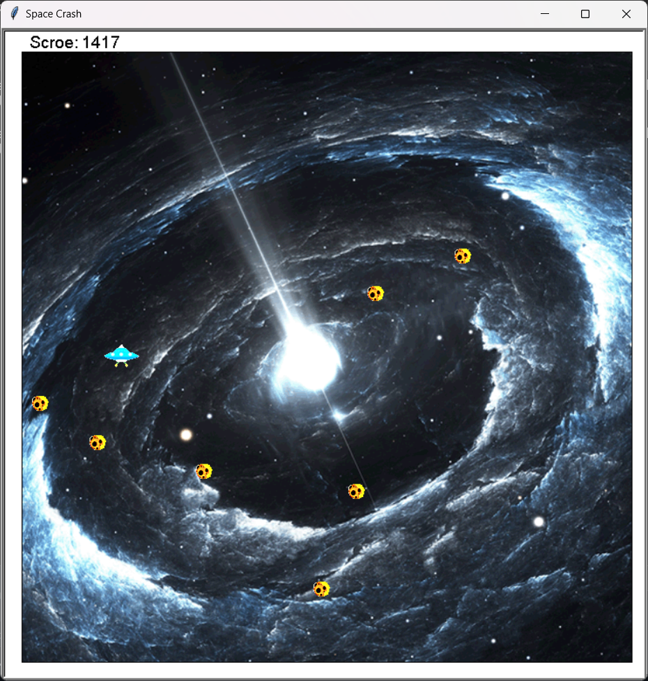
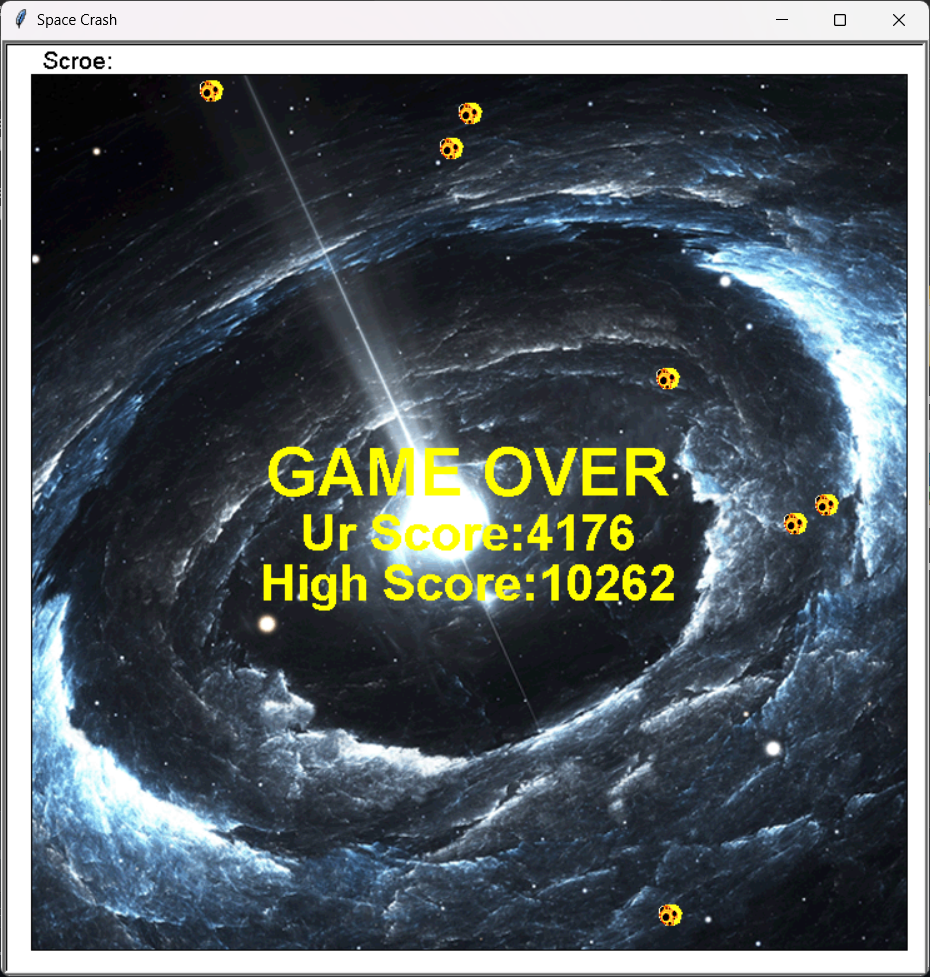

# Space-Crash
A simple 2D game Developed in python

It's a simple 2D game Developed in python with turtle module ans some random functions. It also has a GUI and listeners for keyboard controls. 
It mainly contains square area where randomly asteroids appear and more randomly the spaceship which we control with the keyboard controls. On main task is to control spaceship and save it from asteroids if it hit the asteroid the game is over. The speed of the asteroids increase by time.n The score will be calculated by the time the spaceship survive without crashing. It also has a feature to store the highest score.
It mainly contains 2 GUI screens

  * Game Play

    

  
  * Game Over

